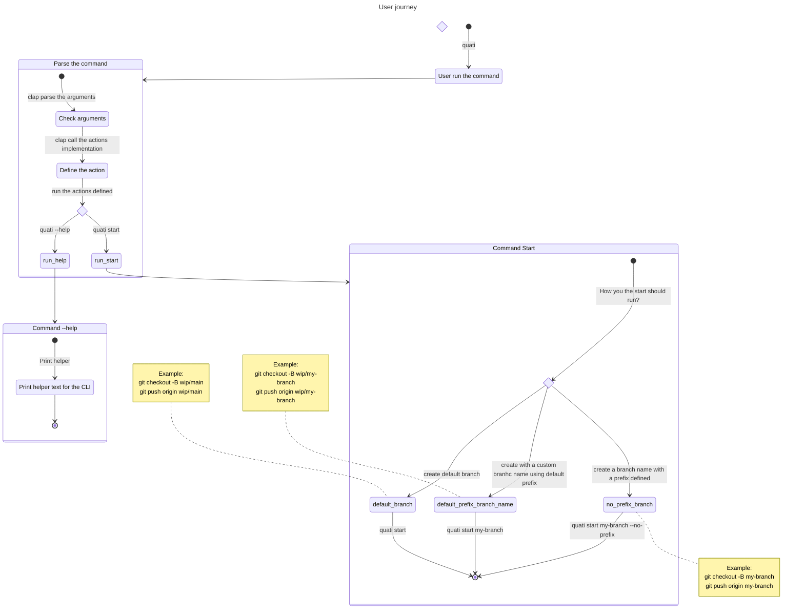

# Quati  command-line

Versioning on this project mean:

| Major                   | Minor            | Patch                  |
| ----------------------- | ---------------- | ---------------------- |
| Break change or release | Finish an "EPIC" | Merge a task/story/fix |

This is a commandline line tool that help you to work with AI libraries to support development.

It is build in rust.

> Note: The agent setup (e.g copilot, codex) need be done before run the cli.
> It means, that you need to open, do login, setup etc. Or write a custom agent_command that setup it.

## Usage

The table bellow show the commands and how to use it:

| Argument | Optional                      | Descripion                                                                              | Example                                                                |
| -------- | -----------------             | ---------------------------------------------------------------                         | ------------------------------------------------------------           |
|          | `-V`, `--verions`             | Print the version                                                                       | `quati -V`                                                             |
|          | `-h, --help`                  | Print the helper                                                                        | `quati -h`                                                             |
| start    |                               | Create a branch and push it to origin with `wip/current_branch`                         | `quati start`                                                          |
| start    | `--feat`                      | Create a branch and push it to origin with `feat/current_branch`                        | `quati start --feat`                                                   |
| start    | `--fix`                       | Create a branch and push it to origin with `fix/current_branch`                         | `quati start --fix`                                                    |
| start    | `--release`                   | Create a branch and push it to origin with `release/current_branch`                     | `quati start --release`                                                |
| start    | `[BRANCH_NAME]`               | Create and push the branch with the name defined                                        | `quati start feature-123`                                              |
| save     |                               | Commit all changes with message generated by AI                                         | `quati save`                                                           |
| save     | `-w, --with`                  | Pass a reference file to be used to build the message                                   | `quati save -w feature.md`                                             |
| save     | `-N, --no-verify`             | Pass `--no-verify` when do commit                                                       | `quati save -N`                                                        |
| save     | `-h, --help`                  | Print the helper                                                                        | `quati save -h`                                                        |
| save     | `-p, --prompt`                | Custom prompt to generate message. Override `QUATI_PROMPT`.                             | `quati save -p "Write a title using convenitional commit"`             |
| save     | `-q, --quite`                 | Print only log errors. Can be used with other options.                                  | `quati save -q`                                                        |
| update   |                               | Same as `save` but also push to origin, if no change just push                          | `quati update`                                                         |
| update   | `-w, --with`                  | Pass a reference file to be used to build the message                                   | `quati update -w feature.md`                                           |
| update   | `-N, --no-verify`             | Pass `--no-verify` when do commit and push                                              | `quati update -N`                                                      |
| update   | `-h, --help`                  | Print the helper                                                                        | `quati update -h`                                                      |
| update   | `-q, --quite`                 | Print only log errors. Can be used with other options.                                  | `quati update -q`                                                      |
| update   | `-p, --prompt`                | Custom prompt to generate message. Override `QUATI_PROMPT`.                             | `quati update -p "Write a title using convenitional commit"`           |


## CUSTOMIZE SETTINGS

To global settings, define it on `$HOME/.quatirc`. 
For local settings create `.quatirc` in the root of the git project (same level of `.git` folder).

| NAME                     | Description                                                                     | Default |
| ------------------------ | ------------------------------------------------------------------------------- | ------- |
| `QUATI_AGENT`            | Agent name that will run the cli                                                | `codex` |
| `QUATI_AGENT_PATH`       | Path of cli executable. If defined will overide the `QUATI_AGENT` definition    |         |
| `QUATI_AGENT_COMMAND`    | Custom command to be used to run, add `{?}` where the prompt should be replaced |         |
| `QUATI_PROMPT`           | Default prompt message to be used to generate commit message                    |         |
| `QUATI_PREFIX`           | Default prefix used when create branchs                                         | `wip/`  |
| `QUATI_ALWAYS_QUIET`     | Print only logs for errors                                                      | `false` |
| `QUATI_NO_VERIFY`        | set `--no-verify` to commits and push                                           | `false` |
| `QUATI_NO_VERIFY_COMMIT` | set `--no-verify` to commits. Override `QUATI_NO_VERIFY`                        | `false` |
| `QUATI_NO_VERIFY_PUSH`   | set `--no-verify` to push. Override `QUATI_NO_VERIFY`                           | `false` |


Default prompt message:

```
Generate a git commit message for the following changes in @temp_quati_git_diff.patch
Only write the commit message. 
Do not use markdown syntax. 
Write the changes in sections.
Write a detailed list of changes, for each section.
The first line should be a concise summary (max 50 characters), 
followed by a blank line and then a more detailed description. 
The first line should follow the conventional commit format.
```

## How it works

The default behavior for the command `save` is described bellow. 
The only diff from save to `update` is that update push the changes to origin.

1. User want to save the changes in a new commit.
2. User run: `quati save`
3. The app saves the the `git diff` result into a temporary file: `temp_quati_git_diff.patch` 
4. Then the prompt is sent to the agent using the default prompt and default command, e.g `codex "$PROMPT"` or `copilot -p $PROMPT`
5. Getting the response message, the app will parse the response, removing any other content out of the commit message. 
    It uses the conventional commit pattern to understand where the message starts.
6. Use the parsed message to run the `git commit -m $MESSAGE`.

In summary, the command bellow does something similar.

```sh
# Save git diff, ask copilot-cli to produce a commit message, then use it to commit
git diff > /tmp/git_diff.patch && \
cat /tmp/git_diff.patch | copilot-cli --stdin --prompt "Write a concise conventional-commit style git commit message summarizing the following diff:" > /tmp/commit_message.txt && \
git commit -F /tmp/commit_message.txt
```

## Why generate a git diff file?

When I tried to pass the diff directly via prompt I did not get a good answer.
The easier solution I found was creating a file and use it as reference.

## Diagrams


