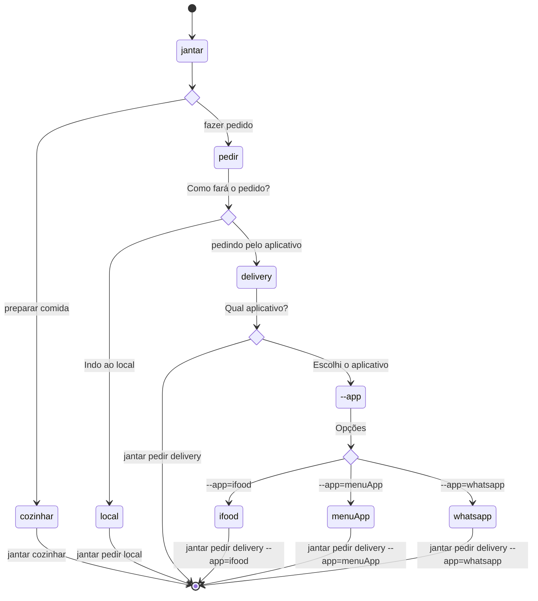

> Este tutorial irá descrever o processo de desenvolvimento desta CLI.
> A ideia é ter uma documentação que sirva de exemplo para estudos futuros.

---

- [Definições técnicas](#definições-técnicas)
  - [O que é uma CLI?](#o-que-é-uma-cli)
    - [Argumentos](#argumentos)
    - [Validações](#validações)
    - [Testes](#testes)
- [Etapas de desenvolvimento](#etapas-de-desenvolvimento)
  - [Task 1: Inicializando CLI com o comando help e version](#task-1-inicializando-cli-com-o-comando-help-e-version)
    - [TDLR;](#tdlr)
    - [Objetivo:](#objetivo)
    - [Vamos ao código](#vamos-ao-código)
    - [Epilogo](#epilogo)
  - [Task 2: Criando comando START](#task-2-criando-comando-start)
    - [Objetivo](#objetivo-1)
    - [Vamos ao código](#vamos-ao-código-1)

---

# DESENVOLVENDO quati-cli

Quati-cli é um projeto criado no intuito de otimizar o processo de escrita de mensagens de commit.
Através de um simples comando será possível salvar todas as alterações e subir para a origem com uma mensagem descritiva sobre as modifições naquele commit.

Utilizando de agentes de IA, como copilot, será solicitada a IA para gerar a mensagem de commit.
Para isso, iremos passar um arquivo diff, com as alterações, e o que mais achar necessário.

Quati-cli consistem em 3 comandos: `start`, `save`, `update`.

- `start`: Cria uma nova branch na origem
- `save`: Efetua um commit local com a mensagem gerada pela IA
- `update`: Além de agir como o save, também faz push na branch atual.

## Definições técnicas

- Linguage: [Rust](https://rust-lang.org/)
- Principais depências:
  - Contrução da CLI: [clap](https://docs.rs/clap/latest/clap/_concepts/index.html)
- Metodologia de desenvolvimento:
  - Test Driven Development ([TDD](https://pt.wikipedia.org/wiki/Test-driven_development))

### O que é uma CLI?

Nesta sessão buscarei explica a estrutura de uma CLI para que fique mais simples de explicar
a implementação abaixo.

Basicamente, a CLI consiste de um programa que recebe argumentos que irão definir o que será
executado. No nosso caso, nosso programa se chamará `quati`.

A partir daí tudo será como se fosse uma árvore de decisão. Mas, o que seria isso?

Imagine que deseja jantar, você primeiro pode decidir por cozinhar ou comprar a comida.
Nesse caso a primeira decisão seria `cozinhar` ou `pedir`. Se jantar fosse uma cli,
teriamos então os dois comandos `jantar cozinhar` ou `jantar pedir`.

Se decidimos comprar, devemos decidir como iremos comprar, logo poderemos pedir delivery ou ir
ao um restaurante. Assim, teriamos mais dois commandos agregados, `delivery` ou `local`. Assim
um o camando de comprar poderia ser `jantar comprar delivery`.

Se prefir diagramas, seria mais ou menos assim:



Assim, se você observar o fluxo da árvore, existe caminhos que podem ser seguidos
para um mesmo objetivo.

Todas as ações que não são opcionais levam a um próximo caminho, já outras pode
encerrar antes mesmo, e ao fim temos um comando a ser execultado.

A nomeclatura que se usar em uma CLI segue um padrão:

`programa [argumentos_obrigatórios] [--argumentos_opcionais]` ou  
`programa [argumentos_obrigatórios] [-argumentos_opcionais]`

Tendo isso em mente, agora podemos falar sobre os tipos de argumentos, e como eles são divididos 
dentro do `clap`.

#### Argumentos

Existem alguns tipos de [argumentos](https://docs.rs/clap/latest/clap/_derive/_tutorial/index.html#adding-arguments):

- Positionals (Posicional): Que dependem da ordem para ter significado. Necessitam de valores.
  - Todo campo na struct é um posicional. Logo a ordem influencia.
- Options (Opções): A maior diferença deles para Positionals é que possuem um prefixo `--` antes do nome e que não independentes de posição. Necessitam de valores.
  - Necessida da notação mínima `#[arg(short)]`:
    - Sem parâmetro, é utiliza o mesmo nome definido
    - `#[arg(short='n')]` = `-n`: Se nenhum long definido, não existirar um valor para `--field`
- Flags: Semelhantes a Options, mas são condicionais, ON ou OFF. Se existir, ON, se não OFF.
- Optional (Opcionais):
  - Todo argumento é por padrão obrigatório. Para modificar isso precisa passar `Option<type>`
- Defaults (Padrão): Funciona semelhante ao Optional, mas neste caso define um valor padrão para esse fim
  - `#[arg(default_value_t='something')]`
- Subcommands (Subcomandos, ou subargumentos):
  - definido por `#[command(subcommand)]` no campo da struct
    - O tipo recebido é um enum, que possue `#[derive(Subcommand)]`

Abaixo temos um exemplo na qual retorna os tipos de argumentos:

```rs
use clap::{Parser, Subcommand};

#[derive(Parser)]
#[command(version, about, long_about = None)]
pub struct Cli {
    #[command(subcommand)]
    sub_command: Actions,

    // Run in quiet mode
    #[arg(short = 'q', long)]
    optional_flag_argument: Option<bool>,
}

#[derive(Subcommand)]
enum Actions {
    Start {
        positionin_argument: String,

        #[arg(short = 'N', long = "no-verify", default_value_t = false)]
        optional_argument_using_default_value: bool,
    },
}
```

Ao executar o `--help`temos:

```
Usage: quati [OPTIONS] <COMMAND>

Commands:
  start  
  help   Print this message or the help of the given subcommand(s)

Options:
  -q, --optional-flag-argument <OPTIONAL_FLAG_ARGUMENT>  [possible values: true, false]
  -h, --help                                             Print help
  -V, --version                                          Print version
```

Para `start --help`:

```
Usage: quati start [OPTIONS] <POSITIONIN_ARGUMENT>

Arguments:
  <POSITIONIN_ARGUMENT>  

Options:
  -N, --no-verify  
  -h, --help       Print help
```

#### Validações

É possível validar os argumentos de uma forma simples:

- [Enum](https://docs.rs/clap/latest/clap/_derive/_tutorial/index.html#enumerated-values): 
  utilizando o atributo `#[arg(value_enum)]` e passando um enum como tipo. Somente os valores 
  listados no enum são aceitos.
  - **Obs:** Um subcomand funciona de forma similar
- [Validated Values](https://docs.rs/clap/latest/clap/_derive/_tutorial/index.html#validated-values):
  utilizando da macro `clap::value_parser!` é possível efetuar validação e ainda converter tipos.
  - Utilizando atribut `#[arg=(value_parser = clap::valu_parser!)]`
    - Exemplo: ` #[arg(value_parser = clap::value_parser!(u16).range(1..))]`
      - Aceita somente digitos
- [`ArgGroup` ou `Argument Relations`:](https://docs.rs/clap/latest/clap/_derive/_tutorial/index.html#argument-relations)
  - É possível utilizar de duas formas (ou mais :D)
    - Podemos dizer que uma struct é obrigatória mas não aceita multiplos campos: 
      ```rs 
      #[derive(Args)] 
      #[group(required = true, multiple = false)]
      struct Vers {
        A,
        B
      }
      ```
      - Isso significa que somente um dos campos em Vers pode existir, é um relacionamento XOR, 
      ou um ou o outro, nunca os 2 ao mesmo tempo.
    - Ou podemos utilizar de um agrupamento entre argumentos
      ```rs
      /// some regular input
      #[arg(group = "input")]
      input_file: Option<String>,

      /// some special input argument
      #[arg(long, group = "input")]
      spec_in: Option<String>,

      #[arg(short, requires = "input")]
      config: Option<String>,
      ```
      - Isso como resultado, os campos `input_file` e `spec_in` dentro do `group="input"`
      - O campo `config` só pode existir se alguém do `group="input"` estiver
- Também existe uma validação customizada, mas não irei abordar aqui, para mais detalhes veja a 
  [documentação sobre validação customizada](https://docs.rs/clap/latest/clap/_derive/_tutorial/index.html#custom-validation).

#### Testes

> **Para a nossa alegria :D...**  

Clap possue um método que efetua valdação da estrutura da CLI, 
ele reporta a maioria dos erros cometidos por devs ao construir uma CLI.

Ao invés de verificar todos os comandos e sub-comandos, basta executar `Command::debug_assert!`.
Logo basta um único teste para validar toda a estrutura de argumentos:

```rs
// src/cli_struct.rs
#[cfg(test)]
mod tests {
    #[test]
    fn verify_cli() {
        use clap::CommandFactory;
        crate::cli_struct::Cli::command().debug_assert();
    }
}
```

## Etapas de desenvolvimento

Nesta sessão será descrita em formado de Tasks, o processo de construção da CLI.

### Task 1: Inicializando CLI com o comando help e version

#### TDLR;

Está com pressa? Esse é o código implementado para a task. A explicação está logo após.

```rs
// tests/args.rs
use assert_cmd::cargo::*; // Import cargo_bin_cmd! macro and methods
use predicates::prelude::*;

#[test]
fn should_show_help() {
    let mut cmd = cargo_bin_cmd!("quati");
    cmd.arg("--help");
    cmd.assert().success().stdout(predicate::str::contains(
        "CLI to manage git changes with AI assistance",
    ));
}
```

```rs
// src/args.rs
use clap::Parser;

/// CLI to manage git changes with AI assistance
#[derive(Parser)]
#[command(version, about, long_about = None)]
pub struct Args {}
```

```rs
mod args;

use args::Args;
use clap::Parser;

fn main() {
    Args::parse();
}
```

#### Objetivo:

- Executando o comando `quati` ou `quati -h` ou `quati --help`  e exibir o helper da CLI
- Executando o comando `quati -v` ou `quati --version` irá exibir a versão atual da aplicação. 

Toda CLI tem um comando `help` que explica como a utiliza.
Iniciar o desenvolvimento com o `help` nos auxilia na construção da estrutura da CLI sem que precisemos implementar muito código específico.
Apesar de nem todas possuirem o comando version, iremos implementar para seguirmos com um versionamento `semver` do projeto.

Seguindo a ideia do TDD, iremos primeiro criar o teste com o mínimo necessário.

Quando se pensa no mínimo, a primeira coisa que podemos imagina seria executar executar o comando e trazer o titulo da CLI.

Logo o primeiro caso de uso seria:

| Nº  | Dado que                                                                   | Quando                                  | Então                                                                                           |
| --- | -------------------------------------------------------------------------- | --------------------------------------- | ----------------------------------------------------------------------------------------------- |
| 1   | executo `quati -h` no terminal **OU** executo `quati --helper` no terminal | desejo ter informações de como usar CLI | exibo o mensage de `help` no projeto com o texto `CLI to manage git changes with AI assistance` |

 

> O caso de uso acima foi descrito utiilzando [GIVEN-WHEN-THEN](https://martinfowler.com/bliki/GivenWhenThen.html), em uma versão traduzida para PT-BR.
> Todos os casos de suso serão escritos desta maneira

#### Vamos ao código

Iremos implementar um teste de integração para este exemplo.
O principal motivo para isso é que o a função `help` é nativa da biblioteca `clap`.

Neste momento, queremos testar somente o titulo da CLI.

Por convensão, `cargo` interpreta o contexto de algumas pastas por padrão.

- `tests/`: testes de integração
- `benches/`: para benchmarks
- `examples/`: para exemplos
- `src/`: para código-fonte principal do projeto

> Referência: [Testing CLI applications by running them](https://rust-cli.github.io/book/tutorial/testing.html#testing-cli-applications-by-running-them)

Assim sendo, criemos o nosso arquivo de teste em `tests/args.rs`. Veja abaixo o código de teste

```rs
use assert_cmd::cargo::*;
use predicates::prelude::*;

#[test]
fn should_show_help() {
    let mut cmd = cargo_bin_cmd!("quati");
    cmd.arg("--help");
    cmd.assert().success().stdout(predicate::str::contains(
        "CLI to manage git changes with AI assistance",
    ));
}
```

Para este arquivo funcionar, você precisará adicionar duas dependências ao projeto.

```sh
cargo add assert_cmd predicates
```

- [assert_cmd](https://docs.rs/assert_cmd/latest/assert_cmd/): auxilia no processo para fazer testes de integrações.
- [precidate](https://docs.rs/predicates/latest/predicates/): auxilia na validação dos campos


Agora vamos criar o args.rs que servirá de base para os comandos da CLI:

```rs
use clap::Parser;

/// CLI to manage git changes with AI assistance
#[derive(Parser)]
#[command(version, about, long_about = None)]
pub struct Args {}
```

Para o funcionamento deste código será necessário instalar o pacote [clap](https://docs.rs/clap/latest/clap/).
Clap é um incrível pacote fará todo o processo relacionado aos argumentos da CLI.

Para este momento, nosso teste irá somente validar a descrição da CLI.

A descrição da CLI está no comentário de documentation externa ([Outer Docummentation Comment](https://doc.rust-lang.org/rust-by-example/meta/doc.html)) inicializado por `///`, que serve para documentar o escopoco a seguir. `clap` utiliza desta documentação para descrever a CLI.

Incializamos também o [Parser](https://cursos.alura.com.br/forum/topico-o-que-e-de-fato-parse-ou-parsing-71499) atravez da [syntax de atributos](https://web.mit.edu/rust-lang_v1.25/arch/amd64_ubuntu1404/share/doc/rust/html/book/first-edition/attributes.html) ([from rust docs](https://doc.rust-lang.org/reference/attributes.html)) `#[]`  (que lembra um pouco annotatins em outras linguages `@AlgumaCoisa`).

O próximo atributo definido é o `command` que pode ser utilizado para definir coisas básicas da CLI. Isso também é usado pelo `clap`. No exemplo acima não definimos alguns valores, como version, que é coletado de `Cargo.toml` (veja abaixo) e about que pegará do nosso `///`.

```toml
[package]
name = "quati"
version = "0.0.1"
edition = "2024"
...
```

A struct está vazia, pois ainda não queremos definir opções e comandos para o nossa CLI neste momento.

> Struct é algo que irá definir uma estrutura, um tipo, um objeto. Em java, poderia dizer que seria similar a um record, em typescript um type. **Similar**, ou seja, não é a mesma coisa, mas é por ai.

Agora vamos atualizar nossa main:

```rs
mod args;

use args::Args;
use clap::Parser;

fn main() {
    Args::parse();
}
```

Utilizamos o arquivo args, logo precisamos por [mod args](https://doc.rust-lang.org/rust-by-example/mod.html) para indicar ao compilador que o arquivos args faz parte do módulo atual.

Com isso podemos importar `Args` usando `use args::Args`. Como também precisaremos usar a função parse do clap, importamos usando `use args::Parser`, e assim na função main, executamos `Args::parse()` que inicializará a commandline.

#### Epilogo

Este é o código da primeira tarefa. Nesta tarefa implementamos:

- Teste de integração para exibir o help (`args.rs`).
- Dependências de teste adicionadas (`assert_cmd`, `predicates`).
- Módulo de argumentos (`args.rs`) com `#[derive(Parser)]` e doc comment como descrição.
- Metadados do binário (version) ligados ao Cargo.toml via #[command(version, ...)].
- Declaração mod args; e chamada Args::parse() em main.rs.
- Estrutura mínima pub struct Args {} sem opções ainda.

Conceitos vistos nesta tarefa:

- Testes de integração (pasta `tests`) e execução de binários de CLI para verificar comportamento.
- Uso das crates de teste: `assert_cmd` e `predicates` para invocar o binário e validar saída.
- Sistema de módulos: declaração `mod args;` e organização de código em arquivos separados (args.rs).
- Importações com use (ex.: `use args::Args;`, `use clap::Parser;`).
- Definição de struct (`pub struct Args {}`) como tipo que representa a CLI.
- Derive de traits/implementações via atributos (`#[derive(Parser)]`).
- Atributos de comando do clap (`#[command(version, about, long_about = None)]`) para configurar metadados da CLI.
- Comentários de documentação externa (`///`) usados como descrição da CLI e aproveitados pelo clap.
- Chamada do parser gerado pelo clap (`Args::parse()`) para inicializar a leitura de argumentos.
- Dependência em metadados do pacote (`Cargo.toml`) para obter a versão do binário.
- Convenções do Cargo sobre layout de projeto (`src`, `tests`, `examples/`, `benches/`).
- Princípio de Test Driven Development (TDD) aplicado ao desenvolvimento da CLI.

### Task 2: Criando comando START

#### Objetivo

Nesta tarefa iremos criar o comando START. Este comando irá criar uma branch localmente e fazer o
push na origin.

O camando que iremos implementar rodará das seguinte formas: 

- `quati start`: criará uma branch utilizando o prefixo `wip/` e o nome da branch atual.
  - Exemplo: dado que estamos na branch main, ao rodar `quati start`, 
  resutará em uma branch `wip/main`.
- `quati start minha-branch`: criará uma branch com o nome `wip/minha-branch` no local e na origin.
- `quati start -N minha-branhc` ou `quati start --no-prefix minha-branch`: 
  criará uma branch com nome `minha-branch` no local e na origem

Casos de uso

| id  | GIVEN                                                                | WHEN                                                | THEN                                                                                                                                                                                                    |
| --- | -------------------------------------------------------------------- | --------------------------------------------------- | ------------------------------------------------------------------------------------------------------------------------------------------------------------------------------------------------------- |
| 1   | um repositório git com a origem configurada e com permissões de push | a developer executa `quati start` sem argumentos    | uma nova branch é criada localmente e na origem utilizando o prefixo configurado (padrão `wip/`) com o nome da branch atual (ex: `wip/main`) e a CLI mostra informações das branchs e como encontrá-las |
| 2   | um repositório git com a origem configurada e com permissões de push | a developer executa `quati start BRANCH_NAME`       | uma nova branch é criada localmente e na origem com o nome `BRANCH_NAME`, e a CLI mostra informações das branchs e como encontrá-las                                                                    |
| 3   | a branch escolhida já existe localmente                              | a developer executa `quati start [BRANCH]`          | a CLI muda para a nova branch e syncroniza com a origem, e mostra uma descrição do que foi executado                                                                                                    |
| 4   | there is no `origin` remote or the push fails (network/auth)         | a developer executa qualquer `quati start` variação | a CLI exibe um erro e sugere formas de solucionar o problema (e.g. add remote, check network, retry push, or run manual `git push -u origin <branch>`)                                                  |

#### Vamos ao código

Primeiro iremos criar o teste para este caso.


