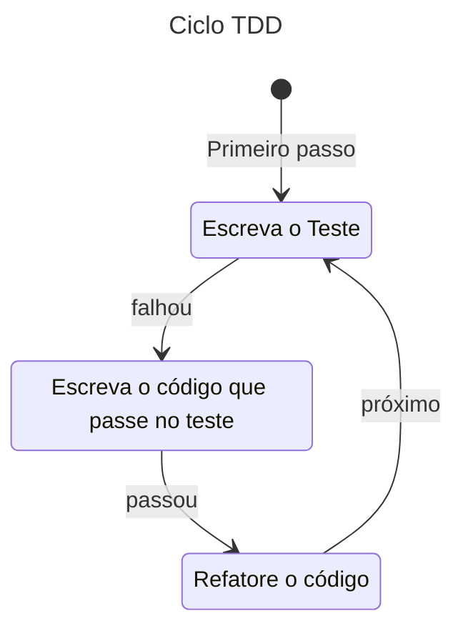

> ---
> # Índice

- [COOKBOOK: Aprendendo com testes](#cookbook-aprendendo-com-testes)
  - [Criando um comando para ler o nome da branch](#criando-um-comando-para-ler-o-nome-da-branch)
    - [Contexto](#contexto)
    - [Sobre a implementação](#sobre-a-implementação)
    - [TDD: Primeira iteração - Iniciando nossa função de teste](#tdd-primeira-iteração---iniciando-nossa-função-de-teste)
      - [`#[cfg(test)]` e `mod tests`](#cfgtest-e-mod-tests)
      - [`#[tests]` e a função de teste](#tests-e-a-função-de-teste)
      - [Finalizando a primeira iteração](#finalizando-a-primeira-iteração)
    - [TDD: Segunda iteração - Inicializando o mock](#tdd-segunda-iteração---inicializando-o-mock)
      - [Iniciando Mock](#iniciando-mock)
      - [Criando a inicialização do mock FakeRunner](#criando-a-inicialização-do-mock-fakerunner)
      - [Implementando método NEW do mock FakeRunner](#implementando-método-new-do-mock-fakerunner)
      - [Atualizando struct FakeRunner](#atualizando-struct-fakerunner)
      - [Implementando a estrutura RunResult](#implementando-a-estrutura-runresult)
      - [Finalizando a iteração](#finalizando-a-iteração)
    - [TDD: Segunda iteração - GitRunner](#tdd-segunda-iteração---gitrunner)
      - [O Teste](#o-teste)
      - [Vamos entender as mudanças:](#vamos-entender-as-mudanças)
      - [Implementando pub trait GitRunner](#implementando-pub-trait-gitrunner)
      - [Finalizando a iteração](#finalizando-a-iteração-1)
      - [Código resultante deta iteração](#código-resultante-deta-iteração)
    - [TDD: Terceira iteração - Git, the real implementation](#tdd-terceira-iteração---git-the-real-implementation)
      - [Explicando o código:](#explicando-o-código)
      - [Implementando RealGitRunner e impl Git](#implementando-realgitrunner-e-impl-git)
      - [Finalizando a iteração](#finalizando-a-iteração-2)
      - [Código resultante deta iteração](#código-resultante-deta-iteração-1)
    - [TDD: Quarta iteração - GitError, melhorando as mensagens de erros](#tdd-quarta-iteração---giterror-melhorando-as-mensagens-de-erros)
      - [Código resultante deta iteração](#código-resultante-deta-iteração-2)
    - [Resultado final](#resultado-final)

---
---


# COOKBOOK: Aprendendo com testes

Objetivo deste documento é aprender RUST através de testes: unitários, integração etc.

Por mais que testes automatizados seja um tópico relativamente avançado, adquirir uma cultura de testes é essencial para qualquer pessoa desenvolvedora.  
Então, porque não começar com os testes? ~~Porque é coisa de doido~~

Uma vez ouvi um colega dizer para mim: 

> "Eu dificilmente subo minha aplicação. Geralmente é a ultima etapa, só para ter certeza. Eu sempre utilizo os testes unitários para executar meu código"

Isso mudou mais uma vez meu estilo de programação. Apesar de muitos considerar que testes atrasam uma entrega. Eu digo que testes postergam problemas. O prazo de entrega pode aumentar algund dias, enquanto um prazo de debug tendem a demorar semanas.

Utilizar TDD (Test Driven Development, Desenvolvimento Orientado a Teste) exige prática, e no começo vai parecer ser bem sem sentido, mas continue firme na prática, isso mudará seu jeito de pensar em como entregar o mínimo.  
Resumidamente, no TDD primeiro você escreve o teste, para aquilo que não existe, isso deve falhar, do contrário, ou o teste está errado, ou a implementação já existe e você não sabia :D.  
A implementação segue um ciclo: Escreve o teste, Faz o teste passar, Refatore o código.



Os exemplos abaixo foram surgindo de acordo com a minha necessidade e meu aprendizado. Não estão necessariamente em alguma ordem.

> **NOTA:**
> Nem tudo deve ser testado, nem todos os testes abaixo devem ser realmente implementados.
> O objetivo deste documento é o aprendizado,

## Criando um comando para ler o nome da branch

> #git #command #mock

### Contexto

COMO uma pessoa desenvolvedora
EU QUERO executar comandos git
PARA que eu possa consultar o nome da branch atual

O comando git para isso é: `git rev-parse --abbrev-ref HEAD`.

Tendo em vista o que queremos fazer e o comando que precisaremos executar, vamos pensar nos critérios.

1. A função deve ser executar o comando git.
2. A função deve receber vários argumentos que juntos irão compor o comando do git
3. Se ocorrer bem, quero ser capaz de ver o resultado.
4. Se algo falha ocorrer, quero ser capaz de ler uma mensagem de erro que me ajude a executar corretamente.

Pronto, agora temos uma ideia básica de como isso tudo funcionará.

### Sobre a implementação

Iremos implementar o nosso projeto buscando seguir o TDD. 
Assim, vamos pensar em pequenos passos, que serão as iterações, e dividiremos as etapas desta forma.

Cada etapa irá implementar uma porção do código, executar teste para validar que nada está quebrado,
faremos um commit para fecharmos essa etapa, e assim temos um ponto de retorno em caso de algum problema.

Nos testes unitários não devemos depender do ambiente externo a aplicação para validarmos o código.
Quando quiser validar a funcionalidade desta forma, faremos um teste de integração :)

Assim, para não dependermos do ambiente externo utilizaremos um conceito que abstrai estas dependências,
os mocks.
Mocks são simulações de integração real, utilizados principalmente para em testes unitários 
de softwares onde eles substituem alguma dependência real. 
Podendo assim, simular os resultados das suas execuções para um comportamento conhecido e desejado.

### TDD: Primeira iteração - Iniciando nossa função de teste

Na nossa primeira iteração iremos inciar a implementação da nossa função de teste.

```rs
#[cfg(test)]
mod tests {
    use super::*;

    #[test]
    fn returns_branch_name_on_success() {
    }
}
```

Vamos agora entender o que significa esse pedacinho de código. Primeiro, vamos entender como fazemos
a assinatura dos testes.

#### `#[cfg(test)]` e `mod tests`

```rs
#[cfg(test)]
mod tests {
    // código
}
```

A definição do teste se da através do atributo de configuração `cfg()`.  
Essa definição de atributo de configuração (`cfg`) indicará ao compilador que
**mod tests** na linha seguinte é relacionada aos testes e precisa ser compilado somente quando
executamos os testes através de `cargo test` executado no terminal.

O termo `mod` indica um que estamos definindo um novo módulo. 
Se compararmos com HTML, seria como abrir uma nova tag dentro de outra:

```html
<arquivo>
  <mod name="tests"></mod>
</arquivo>
```

Sendo o arquivo também considerado um módulo, o `mod tests` indica que estamos definindo um submódulo, um módulo dentro de outro.  
A ideia do HTML é interessante de se trazer porque temos també um conceito similar: `parent`.

O que nos leva ao seguinte código abaixo

```rs
#[cfg(test)]
mod tests {
    use super::*;
    // código
}
```

A palavra chave `use` significa que estamos importando (usando) algo de outro módulo.  
Em outras linguages de programação temos a palavra `import`, por exemplo.

A palavra chave `super` acessa o módulo parente, acima, mais próximo, mais externo.  
A analogia com html faz um sentido melhor aqui. Quando executa `use super::*` estamos importando
tudo do nosso `parent`.  
Que no nosso exemplo, seria o arquivo onde implementaremos nosso código.  
Em visão orientada a objetos, seria como usar extender de outra classe. 
Veja os exemplo abaixo.

---

<details>
<summary>Exemplos de códigos em outras linguagens</summary>

```java
// JAVA
class ParentClass {
  public ParentClass() {}
  public void sum() {}
  public void minus() {}
}

class ChildClass extends ParentClass {}

public static void main(String[] args) {
  ChildClass obj = new ChildClass();
  obj.sum();
}
```

```python
class ParentClass:
    def __init__(self):
        pass

    def sum(self):
        pass

    def minus(self):
        pass

class ChildClass(ParentClass):
    pass

def main():
    obj = ChildClass()
    obj.sum()


if __name__ == "__main__":
    main()
```

</details>

---

Se não desejar manter o teste dentro do mesmo arquivo, é possível separar o teste usando a seguinte estrutura.

Sendo o arquivo a ser testado nomeado como `git.rs`:

1. Cria uma pasta com o mesmo nome, no mesmo nível do arquivo. Exemplo: se `src/git.rs`, então temos `src/git/`.
2. Cria um arquivo tests.rs dentro da pasta criada. Exemplo: `src/git/tests.rs
3. Ao fim do arquivo `git.rs` adicione a linhas abaixo, identificand que o submodulo chamado tests existe e está configurado para testes.

```rs
#[cfg(test)]
mod tests;
```

Assim em `src/git/tests.rs` é possível acessar todos os atributos, inclusive os privados, com `use super::*`.


#### `#[tests]` e a função de teste

Agora que entendemos os módulos, vamo ver nosso teste:

```rs
#[cfg(test)]
mod tests {
    use super::*;

    // Foque nas duas linhas abaixo
    #[test]
    fn returns_branch_name_on_success() {}
}
```

`#[test]` essa definição de atributo indica que o próximo método é um método de teste, logo será
execultado quando rodarmos `cargo test`. (se não sabia, esse é o comando para rodar os testes :D)

`fn returns_branch_name_on_success() {}` esta linha define o nome da função de teste, quando
executarmos o comando `cargo test` esse nome irá ser exibido no terminal, indicando se passou ou não.

#### Finalizando a primeira iteração

Nosso objetivo aqui é criar a função de teste e somente isso. Por que somente? No TDD damos passos
pequenos, mas andamos somente para frente, confiante de que o que construímos funciona e está validado.
Qualquer mudança no projeto que fizer o teste quebrar, significa que alguma regra de negócio foi
drasticamente alterada, atraindo nossa atenção para corrigir o código ou atualizar o testes.
Os testes não estão escritos em pedra, mas só devem ser mudados como ultima escolha.

Sendo assim, vamos executar nossos testes

```sh
cargo test
```

Todos passando, vamos então fazer nosso commit, para registrarmos nosso primeiro `PASS`.

```sh
git add .
git commit -m "feat: wip - inicializado os testes"
```

Agora tudo salvo, vamos continuar para a próxima iteração.


### TDD: Segunda iteração - Inicializando o mock

Agora que entendemos a estrutura do teste, vamos agora implementar nossa primeira linha do teste.

#### Iniciando Mock

```rs
#[cfg(test)]
mod tests {
    use super::*;

    #[test]
    fn returns_branch_name_on_success() {
        let fake = FakeRunner::new(true, "feature/test-branch\n", ""); // primeira linha do teste
    }
}
```

Nesta linha, estamos criando uma variável `fake`, isso é indicado pela palavra chave `let`.  
`let fake`

Depois disso, estamos chamando algo, que chama o método new e passa alguns argumentos.  
Esse algo é o nosso mock, que está nomeado como `FakeRunner`.  

A chamada do método se dá através dos `::`. Essa syntax somente se faz necessária para o primeiro
método, os posteriores não precisa, mas falaremos mais disso posteriormente.  

Depois são passados 3 argumentos:  
`true`: O primeiro do tipo boolean, que significa 1 ou 0, ou, verdadeiro ou falso;  
`"feature/test-branch\n"`: O segundo é uma string, que representa o nome da branch;  
`""`: O terceiro neste momento é uma string vazia, pois o objetivo é que o terceiro seja a mensagem de erro.

---

<details>
<summary>Uma conversa sobre TDD, e o porquê de implementar um método que não existe ainda.</summary>

> Lembre-se que no TDD implementamos o teste daquilo que desejamos implementar de verdade.
Parece bizarro pensar nessa metodologia, a princípio, tipo, por que testar algo que não existe?  
> 
> Na verdade, a ideia não é testar algo que não existe, é testar algo que vai existir.  
> Se pensar da segunda forma, estamos na verdade estamos descrevendo nossos passos.  
> Quando estudei noções de algoritmos na faculdade, eu tinha que escrever comentários que iriam
> indicar o que eu deveria implementar. Algo como, "escrever função de soma", "validar se divisor de 3",
> e por ai vai.  
> Você consegue ver a semelhança? Ao invés de escrever um comentário, eu escrevo uma linha no teste unitário.  
> 
> Assim, estou dizendo para mim que o algoritmo que desejo implementar, eu quero fazer um mock
> chamado `FakeRunner`, e que esse mock deve receber três argumentos.

</details>

---

#### Criando a inicialização do mock FakeRunner

O teste não executará se tentar agora. Isso por que `FakeRunner` nem se quer existe. 

Vamos então criar o `FakeRunner` que será nosso mock

```rs
#[cfg(test)]
mod tests {
    use super::*;

    ////////////////////////
    // CÓDIGO NOVO: 
    struct FakeRunner {
    }
    ////////////////////////

    #[test]
    fn returns_branch_name_on_success() {
        let fake = FakeRunner::new(true, "feature/test-branch\n", ""); // primeira linha do teste
    }
}
```

Neste trecho do código temos a palavra chave `struct`. Ela é utilizada para definir uma estrutura.  
Structs podem ser utilizadas para definir diferentes coisas, orientando-se pelo conceito de chave e valor. 

Em outras linguages, como `typescript`, `struct` pode ser comparado com `types`. 
Ou em `java` ser comparado a um `record`.

Assim, o código acima define uma estrutura (`struct`) chamada `FakeRunner`. 

#### Implementando método NEW do mock FakeRunner

Agora que temos a estrutura do FakeRunner, precisamos implementar o diaxo do método `new`.

```rs
#[cfg(test)]
mod tests {
    use super::*;

    struct FakeRunner {
    }

    ///////////////////////////////////////////////////////////////////
    // Código novo
    impl FakeRunner {
        fn new(success: bool, stdout: &str, stderr: &str) -> Self {
            Self {
                result: RunResult {
                    success,
                    stdout: stdout.as_bytes().to_vec(),
                    stderr: stderr.as_bytes().to_vec(),
                },
            }
        }
    }
    ///////////////////////////////////////////////////////////////////

    #[test]
    fn returns_branch_name_on_success() {
        let fake = FakeRunner::new(true, "feature/test-branch\n", ""); // primeira linha do teste
    }
}
```

Eita que temos mais syntax para explicar agora. :|

Aqui temos outra palavra chave `impl`. 
Esta palavra chave tem um significado semântico para **implementação**.  
Logo podemos ler esta linha de código como: `impl`ementação para `FakeRunner`.  

`impl` tem um papel de adicionar funcionalidade, então imagine que você está 
adicionando uma funcionalidade a struct `FakeRunner`.  
Então, neste caso estamos adicionado a função `new` a struct FakeRunner.

Como a struct é só uma definição, ela não possue funções, utilizamos impl para inserir
funções a estrutura definida.

Para definir uma função utilizamos a palavra chave `fn` seguira pelo nome e os argumentos desejados,
e por fim o tipo do retorno.  

No nosso exemplo temos `fn new(success: bool, stdout: &str, stderr: &str) -> Self {`.  

`fn` define que estamos definindo uma função.  
`new` é p nome da funcão que estamos implementando  
`(success: bool, stdout: &str, stderr: &str)` são os argumentos necessários para a função.
Aqui temos 3 argumentos, `success` que é do tipo bool (sim ou não, true or false, verdadeiro ou falso); `stdout: &str` e `stderr: &str` são é um atributo de texto (string) que não tomam posse do valor enviado (conceito de [borrowing](https://doc.rust-lang.org/book/ch04-02-references-and-borrowing.html));

Também temos o retorno `-> Self`, isso significa que o tipo de retorno é a própria struct.  
Qual a vantagem disso? Podemos fazer chamadas concatenadas como por exemplo se tivessimos uma calculadora, poderiamos executar: `Calculadora::new(10).mais(5).menos(2).restultado()`. Se resultado imprimir a resposta, teríamos o resultado **13**, pois iniciamos a calculadora com o valor de **10**, depois somamos **5**, e depois subtraímos **2**, resultando em **13**.

O mesmo `Self` é utilizado dentro do método `new()`. Isso significa que o retorno do método altera algo interno da estrutura (struct) FakeRunner.  
Nesse exemplo que retornamos a própria struct com o valor de result alterado.
Calma, é sabido que não temos ainda um `result` na struct, nem sabemos o que é `RunResult`, mas lembre-se, é TDD ;)

```rs
Self {
    result: RunResult {
        success,
        stdout: stdout.as_bytes().to_vec(),
        stderr: stderr.as_bytes().to_vec(),
    },
}
```

Queremos retornar um valor estruturado, onde temos o campo result, e este campo contem outra
estrutura que contém valores, success, stdout, stderr. Logo,

O valor de result será uma `struct RunResult`, que possue em seus campos utilizamos os argumentos enviados na chamada da funcão.  
`stdout` e `stderr` recebem os valores no formato de um lista de bytes, por terem sidos definidos como `str`, logo `.as_bytes().to_vec()` converte primeiro o valor para bytes e depois transforma isso em uma lista de bytes.  

Como ainda não implementamos `RunResult` fica estranho ver toda essa conversão acontecendo aqui. 
Mas, lembre-se, se não existe ainda, é porque estamos só definindo como vai ser.

#### Atualizando struct FakeRunner

Dado que a implementação do método new está retornando uma estrutura que não existe, precisamos implementa-la.
Assim, o nosso código ficará da seguinte forma.

```rs
#[cfg(test)]
mod tests {
    use super::*;

    struct FakeRunner {
      ////////////////////////////////
      // Código novo
      result: RunResult;
      ////////////////////////////////
    }

    impl FakeRunner {
        fn new(success: bool, stdout: &str, stderr: &str) -> Self {
            Self {
                result: RunResult {
                    success,
                    stdout: stdout.as_bytes().to_vec(),
                    stderr: stderr.as_bytes().to_vec(),
                },
            }
        }
    }

    #[test]
    fn returns_branch_name_on_success() {
        let fake = FakeRunner::new(true, "feature/test-branch\n", ""); // primeira linha do teste
    }
}
```

Beleza, atualizamos nossa struct com o campo result que possui um tipo `RunResult`, mas agora
precisamos também criar a struct `RunResult`, pois não podemos finalizar nossa iteração com erro.

A seguir, vamos finalmente implementar nossa estrutura RunResult.
Como ela também fará parte da nossa implementação final, pois iremos usar essa estrutura como retorno.
Devemos definir fora do modulo de testes.

#### Implementando a estrutura RunResult

RunResult como indiretamente vimos nos testes implementados acima, a estrutura será a seguinte:

```rs
////////////////////////////////
// Código novo
#[derive(Clone, Debug)]
pub struct RunResult {
    pub success: bool,
    pub stdout: Vec<u8>,
    pub stderr: Vec<u8>,
}
////////////////////////////////

#[cfg(test)]
mod tests {
    use super::*;

    struct FakeRunner {
      result: RunResult;
    }

    impl FakeRunner {
        fn new(success: bool, stdout: &str, stderr: &str) -> Self {
            Self {
                result: RunResult {
                    success,
                    stdout: stdout.as_bytes().to_vec(),
                    stderr: stderr.as_bytes().to_vec(),
                },
            }
        }
    }

    #[test]
    fn returns_branch_name_on_success() {
        let fake = FakeRunner::new(true, "feature/test-branch\n", ""); // primeira linha do teste
    }
}
```

Explicando o código:

```rs
#[derive(Clone, Debug)]
pub struct RunResult {}
```

Aqui temos nossa definição de atributo usando a macro `derive`. Essa macro injeta métodos na `struct RunResult`.  
Logo, temos dois métodos adicionados na `struct`, `clone()` e funcionalidades de debug (`fmt::Debug`).

`clone()` é como o nome diz, clona, ele faz uma cópia da sua estrutura para outra variável.  
Para que precisamos disso? O que faz de rust ser maravilhoso é seu gerencimaneto de memória.  
Com isso temos dois conceitos muito fortes no rust chamados `ownership` (posse) e `borrowing` (emprestar).  
Nesse caso, clone está relacionado a questão da posse.  

---

<details>
<summary>Explicação de ownership por analogias</summary>

> Por exemplo, se você deseja passar um valor de uma variável para outra e simplesmente fizer a atribuição...
> 
> ```rs
> let a = "Oi"
> let b = a
> ```
> 
> ... você está não só atribuindo outra variável, você está passando sua posse para outra variável. O que significa que `a` é uma variável "abandonada" e se você tentar acessar o valor de `a` não será possível.  
> Isso se dá por uma questão de endereço de memória, passar a posse de a para b nada mais é entregar para B o endereço de memória.  
> Imagine que você pediu um delivery de uma pizza no restaurante. O restaurante faz sua pizza e manda pelo entregador, o entregador chega na sua casa e lhe entrega a pizza. Neste exemplo, o restaurante `possui` a pizza, `entrega` a pizza ao motoboy que fará a entrega, e por fim o motoboy `entrega` a pizza a você. Toda vez que há uma ação de `entrega`, há uma tranferência de posse daquele produto. Então:
> 
> ```rs
> let restaurante = "pizza"
> let motoboy = restaurante
> let fominha = motoboy
> ```
> 
> Quando utilizamos o método clone e copiamos o valor, o endereço de memória inicial é preservado, pois aquele valor é copiado para um novo endereço de memória e atribuído a uma variável.  
> Logo, podemos fazer uma analogia aleatória com um show de humor. A humorista faz a piada, na qual tem a risada, a risada é compartilhada pelas pessoas, mas cada um possui sua própria risada, e pode ter aquela pessoa que somente riu porque a pessoa do lado riu. Logo:
> 
> ```rs
> let humorista = "risada"
> let pessoa1 = humorista.clone() // riu da piada
> let pessoa2 = humorista.clone() // riu da piada
> let pessoa3 = pessoa2.clone() // riu da pessoa2
> ```

</details>

---

Ao fazer `#[devive(debug)]` implementamos a possibilidade de imprimir/formatar o valor da struct.  
Logo, é possível executar os comandos abaixos:

```rs
let r = RunResult { success: true, stdout: b"ok".to_vec(), stderr: vec![] };

println!("{:?}", r);
println!("{:#?}", r);
let _ = dbg!(r);
```

Agora voltamos a observar a estrutura completa

```rs
#[derive(Clone, Debug)]
pub struct RunResult {
    pub success: bool,
    pub stdout: Vec<u8>,
    pub stderr: Vec<u8>,
}
```

Ao definirmos a estrutura (struct) temos a palavra chave `pub`. Ela significa public (público)
isso significa que nossa estrutura pode ser acessada fora do módulo que ela definiu.  
Em **RUST** por padrão tudo dentro do módulo é privado, logo, pub se torna necessário para dar acesso externo.


---

<details>
<summary>Explicando com exemplo o conceito de pub</summary>

> Isso vale também para os campos da `struct`, os campos precisam ser definidos com `pub` caso queira
> dar acesso fora. Por exemplo:
> 
> ```rs
> pub struct Pizza {
>     pub sabor: String,
>     tempero: String,
> }
> 
> let piza = Pizza {
>   sabor = "Sushi",
>   tempero = "brocolis"
> }
> 
> println!(piza.sabor) // funciona
> println!(piza.tempero) // não funciona
> ```

</details>

---
 
Os demais campos...

```rs
pub success: bool,
pub stdout: Vec<u8>,
pub stderr: Vec<u8>,
```

... são definições das variáveis

- `success` é do tipo `bool`, aceitando valores binários como `true` ou `false`
- `stdout` e `stderr` são do tipo `Vec<u8>`, que significa aceitarem um vertor de `bytes` do tipo `unsigned 8-bit`
  - Esse formato é util por aceitar dados binários arbitrários (arquivos, saída de processos, rede), não exibindo que seja um UTF-8 válido.

#### Finalizando a iteração

Nesta iteração vimos muitos conceitos e syntax novas, falamos de ownership, borrowing, pub, impl.  
Se desejar ter mais detalhes sobre, a documentação do rust é bem completa :)

Agora vamos finalizar nossa iteração.  
Execute os testes e vamos ver se eles passam:

```sh
cargo test
```

Com isso implementado, vamos então fazer nosso primeiro commit: 

```sh
git add .; 
git commit -m "feat: wip - inicializando mock e adicionando estrutura da resposta"
```

---
> ---
> **Daqui pra baixo temos a versão antiga do texto** 
>
> Estou atualizando a didática para ser mais próxima a como eu faria no "mundo real".
> 

---

````

### TDD: Segunda iteração - GitRunner

Agora que temos uma estrutura de resposta, precisamos pensar numa estrutura para executar o código.

Então, o que queremos fazer?  
Queremos ser capaz de executar um comando git passando uma lista de argumentos para ele.

Pensando agora na ideia do mock, nós temos a `struct FakeRunner`, que representa nosso mock para
executar um comando `git`.  
Se desejamos criar uma função na qual recebe argumentos para executar um comando git, para testar
nosso mock precisa fazer o mesmo.

Existe uma conceito nas linguagens orientada a objetos chamados de `interface`. Uma interface cria
um modelo de assinaturas de funções na qual toda classe que indica que a implementa,
precisará implementar os métodos listados por ela, com a mesma assinatura, e o mesmo retorno.  
Na orientação a objetos isso nos traz a vantagem de podemos usar a interface como o tipo o tipo para
uma variável, tendo assim a certeza que aquele objetos possuem as funções definidas pela interface.

Em Rust também temos algo *similar* (similar, mas não igual) chamado de `trait`. Os traits podem definir
métodos na qual precisam ser implementados por aqueles que dizem que implementa. Logo, teremos as
mesmas funções, com os mermos argumentos e tipos de retornos, para todas as estruturas que o implementam.

#### O Teste

Sabendo da existência do `trait`, podemos usar este conceito para garantir que nosso mock tenha a
mesma chamada de método que a nossa implementação real. Tendo isso em mente, vamos então dizer em
nosso teste que teremos um `trait` chamado `GitRunner`

```rs
// ...códigos da Primeira iteração

#[cfg(test)]
mod tests {
  // ...códigos da Primeira iteração

    impl GitRunner for FakeRunner {
        fn run(&mut self, _args: &[&str]) -> std::io::Result<RunResult> {
            Ok(self.result.clone())
        }
    }
}
```

Logo, com essa impelementação, nós definimos que nosso modk

#### Vamos entender as mudanças:

- `impl GitRunner for FakeRunner {`: **impl**ementação de **GitRunner** **para** a estrutura **FakeRunner**. Essa linha indica que estamos implementando uma definição (trait) para estrutura `FakeRunner`. Em orientação a objeto seria como um `extends` ou `implements` e `GitRunner` seria considerada como uma `interface`. A forma como `impl` funciona é interessante, é como se fossemos adicionando novas funcionalidades a estrutura FakeRunner cada vez que utilizamos. A primeira vez, adicionamos new, da segunda vez, utilizamos uma definição (trait) para dizer que função deveriamos implementar.

```rs
fn run(&mut self, _args: &[&str]) -> std::io::Result<RunResult> {
    Ok(self.result.clone())
}
```

- O código acima representa a função definida no trait `GitRunner`. A assinatura do método, o tipo de retorno, tudo é definido dentro de `GitRunner`. Mas, através de `impl GitRunner for ...` é quando a função realmente é implementada, deixando de ser somente uma assinatura.  
- Nesse caso, nós simplesmente retornamos uma cópia do objeto result, que é definido na função `new`.


Agora vamos implementar `GitRunner` trait que é utilizado como definição para `FakeRunner`

#### Implementando pub trait GitRunner

```rs
pub trait GitRunner {
    fn run(&mut self, args: &[&str]) -> std::io::Result<RunResult>;
}
```

Vamos entender o código acima:

- `pub trait GitRunner {`:
  - Assim como para struct, `pub` é utilizado para definir esta trait como publica, com acesso externo.  
- `fn run(&mut self, args: &[&str]) -> std::io::Result<RunResult>;`:
  - é a definição da função `run`.
  - `&mut self` 
    - significa que estamos passando uma referência que pode ser alterada de "si mesmo",  
  - `args: &[&str]` 
    - significa que podemos receber um array sem limites de valores de texto (string)  
  - `std::io::Result<RunResult>;` 
    - é outra forma de escrever `Result<RunResult, std::io::Error>`. 
    - Isto é usado como retorno de funções IO (input/output, entrada/saída), como é no nosso caso, onde iremos executar um commando git'. 
    - O retorno é um `Ok(RunResult)` caso de sucesso, retornando um resultado na estrutura de `RunResult`; Ou um valor de erro `Err(std::io::Error)` do tipo I/O. 
    - Esse formato é comumento usado para implementar `?` para propagação de error, bem como funções que executan I/O ou chamam outras API com retorno I/O.

Assim como em Orientação a Objeto, na qual temos uma `interface` que é uma abstração de uma implementação real, e então implementamos uma `classe` que implementa esta `interface` de modo a termos uma classe concreta, em rust faremos algo semelhante.

#### Finalizando a iteração

Vamos então executar nosso teste: 

```sh
cargo test
```

Tudo estando OKAY, podemos fazer nosso segundo commit:

```sh
git add .; 
git commit -m "feat: wip implementando trait GitRunner"
```

#### Código resultante deta iteração

```rs
#[derive(Clone, Debug)]
pub struct RunResult {
    pub success: bool,
    pub stdout: Vec<u8>,
    pub stderr: Vec<u8>,
}

pub trait GitRunner {
    fn run(&mut self, args: &[&str]) -> std::io::Result<RunResult>;
}

#[cfg(test)]
mod tests {
    use super::*;

    struct FakeRunner {
        result: RunResult,
    }

    impl FakeRunner {
        fn new(success: bool, stdout: &str, stderr: &str) -> Self {
            Self {
                result: RunResult {
                    success,
                    stdout: stdout.as_bytes().to_vec(),
                    stderr: stderr.as_bytes().to_vec(),
                },
            }
        }
    }

    impl GitRunner for FakeRunner {
        fn run(&mut self, _args: &[&str]) -> std::io::Result<RunResult> {
            Ok(self.result.clone())
        }
    }
```

### TDD: Terceira iteração - Git, the real implementation

Nesta iteração faremos o teste que desejamos.

```rs
#[cfg(test)]
mod tests {
    /**
     * Código á implementado
        struct FakeRunner {}
        impl FakeRunner {}
        impl GitRunner for FakeRunner {}
     */

    #[test]
    fn returns_branch_name_on_success() {
        let fake = FakeRunner::new(true, "feature/test-branch\n", "");
        let mut git = Git::with_runner(Box::new(fake));
        let branch = git
            .get_current_branch_name()
            .expect("expected branch name on success");
        assert_eq!(branch, "feature/test-branch");
    }
}
```

#### Explicando o código:

- `#[test]`: 
  - Esse atributo indica que a função seguinte é um teste  
- `fn returns_branch_name_on_success() {`: 
  - Assinatura da função, o nome da função será o nome exibido no terminal.
- `let fake = FakeRunner::new(true, "feature/test-branch\n", "");`: 
  - nesta linha inicializamos o nosso mock runner. 
  - Nele passamos o valor de sucesso e o nome da branh na qual querermos retornar, o terceiro parâmetro é de erro, não necessário neste teste.  
- `let mut git = Git::with_runner(Box::new(fake));`: 
  - Nesta linha implementamos o nossa implementação concreta do trait GitRunner. Iremos implementar a seguir, logo, o teste falhará por isso.

```rs
let branch = git
    .get_current_branch_name()
    .expect("expected branch name on success");
```

- O código acima executa o método de git.
- `assert_eq!(branch, "feature/test-branch");`: 
  - aqui temos a nossa validação no teste. Esta linha que indica se o teste foi sucesso.

Agora que entendemos o teste implementado, vamos escrever nosso código para passar

#### Implementando RealGitRunner e impl Git

Neste código acima temos a chamada do método, que ainda iremos implementar.

Iremos definir uma estrutura (`struct`) que será nossa implementação concreta da nossa interface (`trait`).

```rs
pub struct RealGitRunner;
```

Abaixo temos a "implementação concreta"

```rs
impl GitRunner for RealGitRunner {
    fn run(&mut self, args: &[&str]) -> std::io::Result<RunResult> {
        let output = Command::new("git").args(args).output()?;
        Ok(RunResult {
            success: output.status.success(),
            stdout: output.stdout,
            stderr: output.stderr,
        })
    }
}
```

Explicando o código

- `impl GitRunner for RealGitRunner {`: 
  - **implementar** o trait **GitRunner** **para** a estrutura **RealGitRunner**. 
    - Parece lógico né? Estamos implementando um `trait` em uma `struct`.
- `fn run(&mut self, args: &[&str]) -> std::io::Result<RunResult> {`:
  - veja que contém a mesma assinatura que o método do trait, isso significa que esta é a implementação real da função.
- `let output = Command::new("git").args(args).output()?;`:
  - Esta linha executa o comando do **git** passando a lista de argumentos.

```rs
Ok(RunResult {
    success: output.status.success(),
    stdout: output.stdout,
    stderr: output.stderr,
})
```

- As linhas acimas são o retorno de sucesso da chamada da função. 
- Para nosso exemplo, não precisaremos de um retorno de falha `Err()`, pois `output()?` já faz esse papel.

Agora vamos escrever a nossa implementação final:

```rs
pub struct Git {
    runner: Box<dyn GitRunner>,
}

impl Git {
    /// Create a client that uses the real `git` binary.
    pub fn real() -> Self {
        Self {
            runner: Box::new(RealGitRunner),
        }
    }

    /// Create a client with a custom runner (useful for tests).
    pub fn with_runner(runner: Box<dyn GitRunner>) -> Self {
        Self { runner }
    }

    /// Get the current branch name. Returns `Ok(branch)` on success or `Err(GitError)` on failure.
    pub fn get_current_branch_name(&mut self) -> Result<String, GitError> {
        let result = self
            .runner
            .run(&["rev-parse", "--abbrev-ref", "HEAD"])
            .map_err(GitError::Io)?;

        if result.success {
            Ok(String::from_utf8_lossy(&result.stdout).trim().to_string())
        } else {
            let stderr = String::from_utf8_lossy(&result.stderr).to_string();
            Err(GitError::GitFailed(stderr))
        }
    }
}
```

Vamos conversar sobre o código:

```rs
pub struct Git {
    runner: Box<dyn GitRunner>,
}
```

- O código acima define a estrutura do Git.  
- `runner: Box<dyn GitRunner>,`: 
  - Alocação de ponteiro-heap para algum tipo concreto de uma implementação do GitRunner, mas que em tempo de compilação está vazio, pois sua alocação se dá em tempo de execução. **Box<>** é um trait que aloca um espaço na memória heap e armazena um ponteiro próprio para o conteúdo. **dyn GitRunner**, é um trait para objeto que habilita uso dinâmico através de uma [vtable](https://users.rust-lang.org/t/v-tables-differences-between-rust-and-c/92445/2) em tempo de execução.

Entendido como funciona a estutura, agora vamos a sua implementação:

```rs
impl Git {
    /// Create a client that uses the real `git` binary.
    pub fn real() -> Self {
        Self {
            runner: Box::new(RealGitRunner),
        }
    }

    /// Create a client with a custom runner (useful for tests).
    pub fn with_runner(runner: Box<dyn GitRunner>) -> Self {
        Self { runner }
    }

    /// Get the current branch name. Returns `Ok(branch)` on success or `Err(GitError)` on failure.
    pub fn get_current_branch_name(&mut self) -> Result<String, GitError> {
        let result = self
            .runner
            .run(&["rev-parse", "--abbrev-ref", "HEAD"])
            .map_err(GitError::Io)?;

        if result.success {
            Ok(String::from_utf8_lossy(&result.stdout).trim().to_string())
        } else {
            let stderr = String::from_utf8_lossy(&result.stderr).to_string();
            Err(GitError::GitFailed(stderr))
        }
    }
}
```

- `impl Git {`: 
  - Inicialização da implementação da struct Git  
- `pub fn real() -> Self {`: 
  - Esse método retorna uma implementação "verdadeira" para o uso real. O nome da funcão ser `real()` é uma convenção. Isso indica que este método não retorna um objeto mockado ou alguma versão difereciada.

```rs
Self {
    runner: Box::new(RealGitRunner),
}
```

Essa parte do método `real()` executa um acesso a variável definida na `struct`. Este termo `Self` indica que estou dentro de um contexto interno.  
Sendo assim, o método altera o o valor de `runner` com um novo `Box` usando `RealGitRunner` como execultável

- `pub fn with_runner(runner: Box<dyn GitRunner>) -> Self {`: 
  - este é o maravilhoso método usado no teste. Ele aceita um parâmetro do tipo `Box<dyn GitRunner>` e define ele no runner. Em outras linguagens de programação isso poderia ser chamado de um método `set`, mas por legibilidade `with_algumacoisa()` tem uma melhor legibilidade, sobretudo em chamadas de métodos concatenados.  
- `Self { runner }`: 
  - assim, o método somente tem uma definição direta do runner. Como o nome do parâmetro da função é igual ao valor na struct, não se faz necessário escrever `runner: runner`.

Agora vamos falar do nosso método para consultar a branch:

```rs
pub fn get_current_branch_name(&mut self) -> Result<String, String> {
  let result = self
      .runner
      .run(&["rev-parse", "--abbrev-ref", "HEAD"])
      .output()?

  if result.success {
      Ok(String::from_utf8_lossy(&result.stdout).trim().to_string())
  } else {
      Err("We have a problem")
  }
}
```

Vamos então explicar o código:

- `pub fn get_current_branch_name(&mut self) -> Result<String, String> {`: 
  - Aqui temos a assinatura do método onde o parâmetro da função é um `&mut self`. 
  - **&mut self** aqui existe por conta da implementação dinâmica do runner. Como a definição do runner não é feita em tempo de compilação, a consequência disso é que precisamos dizer ao nosso método que `self` pode ser alterado a qualquer momento. 
  - **Result<String, GitError>** significa que iremos retornar um `Ok()` (para sucesso) ou um `Err()` (para falha), onde o retorno de Ok é uma string e o de Err é um tipo String (Isso irá mudar na próxima iteração para um erro mais customizado).  

```rs
let result = self
    .runner
    .run(&["rev-parse", "--abbrev-ref", "HEAD"])
    .output()?
```

O código acima execulta o comando do git através do runner definido. Isso significa que para usar o método precisamos sempre fazer uma chamada em sequência: `git.real().function_desired()`. Assim garantiremos que sempre teremos um runner definido em tempo de execução.

```rs
if result.success {
    Ok(String::from_utf8_lossy(&result.stdout).trim().to_string())
} else {
    Err("We have a problem")
}
```

Nesse trecho de código, temos aqui uma validação do resultado do comando. Caso de sucesso, retornamos uma string. Caso falso, também uma string, mas com mensagem de erro.  
`Ok(String::from_utf8_lossy(&result.stdout).trim().to_string())`:

- `&result.stdout`: 
  - Contém o resultado do comando em um formato de `bytecode`, um `Vec<u8>`. 
  - O `&` indica que estamos passando uma referência ao valor, chamamos isso de [`borrowing`](https://doc.rust-lang.org/book/ch04-02-references-and-borrowing.html). 
    - **Borrowing** é um conceito muito necessário em Rust, vale a pena dedicar um tempo lendo sobre.
- `String::from_utf8_lossy(&result.stdout)`: 
  - Converte os bytes em um texto UTF-8. Usamos este método para converter bytes para texto UTF-8 com tolerância a falha, caso dé erro, caracteres como `�` são inseridos como `texto`
- `.trim()`: 
  - remove espaços em branco no início e fim.
- `.to_string()`: 
  - Converte o resultado em um String alocado (owned). Isso garante que quem chama o método irá deter posse do resultado ([ownership](https://doc.rust-lang.org/book/ch04-01-what-is-ownership.html)). 
    - **Ownership** é outro conceito de extrema importância em rust. 

> Em um resumo nada convencional de explicar, ownership e borrowing são os meios do rust de fazer com que a pessoa desenvolvedora seja responsável pelo garbage collector :D


#### Finalizando a iteração

Agora com a implementação concluída, vamos verificar se os testes estão passando:

```sh
cargo test
```

Com tudo passando corretamente, vamos então efetuar mais um commit :)

```sh
git add .;
git commit -m "feat: wip - criada implementação concreta do executável para o Git"
```

Na próxima iteração iremos concluir a primeira feature adicionando validações para os erros.

#### Código resultante deta iteração

```rs
#[derive(Clone, Debug)]
pub struct RunResult {
    pub success: bool,
    pub stdout: Vec<u8>,
    pub stderr: Vec<u8>,
}

pub trait GitRunner {
    fn run(&mut self, args: &[&str]) -> std::io::Result<RunResult>;
}

pub struct RealGitRunner;

impl GitRunner for RealGitRunner {
    fn run(&mut self, args: &[&str]) -> std::io::Result<RunResult> {
        let output = Command::new("git").args(args).output()?;
        Ok(RunResult {
            success: output.status.success(),
            stdout: output.stdout,
            stderr: output.stderr,
        })
    }
}

pub struct Git {
    runner: Box<dyn GitRunner>,
}

impl Git {
    /// Create a client that uses the real `git` binary.
    pub fn real() -> Self {
        Self {
            runner: Box::new(RealGitRunner),
        }
    }

    /// Create a client with a custom runner (useful for tests).
    pub fn with_runner(runner: Box<dyn GitRunner>) -> Self {
        Self { runner }
    }

    /// Get the current branch name. Returns `Ok(branch)` on success or `Err(GitError)` on failure.
    pub fn get_current_branch_name(&mut self) -> Result<String, GitError> {
        let result = self
            .runner
            .run(&["rev-parse", "--abbrev-ref", "HEAD"])
            .map_err(GitError::Io)?;

        if result.success {
            Ok(String::from_utf8_lossy(&result.stdout).trim().to_string())
        } else {
            let stderr = String::from_utf8_lossy(&result.stderr).to_string();
            Err(GitError::GitFailed(stderr))
        }
    }
}

#[cfg(test)]
mod tests {
    use super::*;

    struct FakeRunner {
        result: RunResult,
    }

    impl FakeRunner {
        fn new(success: bool, stdout: &str, stderr: &str) -> Self {
            Self {
                result: RunResult {
                    success,
                    stdout: stdout.as_bytes().to_vec(),
                    stderr: stderr.as_bytes().to_vec(),
                },
            }
        }
    }

    impl GitRunner for FakeRunner {
        fn run(&mut self, _args: &[&str]) -> std::io::Result<RunResult> {
            Ok(self.result.clone())
        }
    }

    pub fn get_current_branch_name(&mut self) -> Result<String, String> {
        let result = self
            .runner
            .run(&["rev-parse", "--abbrev-ref", "HEAD"])
            .output()?

        if result.success {
            Ok(String::from_utf8_lossy(&result.stdout).trim().to_string())
        } else {
            Err("We have a problem")
        }
    }
}
```

### TDD: Quarta iteração - GitError, melhorando as mensagens de erros

Até a terceira iteração, já tinhamos o código funcionando e testado.  
Mas, as mensagens de erros devem ser melhor trabalhadas.  
A pior coisa para um desenvolvedor é ver um problema e não ter a menor ideia do
motivo por traz daquilo.

Então, se iremos implementar uma rotina de teste mais bem elaborada, vamos então
escrever os testes para isso. A explicação está condiga no próprio código, através de comentários `//`

```rs
#[cfg(tests)]
mod test {
    /**
     * Código anterior já implementado, somente a primeira linha :D
    use super::*;
    struct FakeRunner {
    impl FakeRunner {
    impl GitRunner for FakeRunner {
    #[test]
    fn returns_branch_name_on_success() {
     */

    /**
     * Implementação do teste para quando falhar
     */
    // Definição da função de teste com o nome que será exibido ao rodar cargo tests
    #[test]
    fn returns_error_when_git_fails() {
        // Aqui temos a implementação do mock
        // Observe o detalhe que o segundo parâmetro está vazio, isso indica que no 
        //    caso de retorno OK será um resultado vazio.
        // Logo o retorno desejado está no terceiro parâmetro. Onde na implementação do mock
        //    corresponde ao retorno do erro.
        let fake = FakeRunner::new(false, "", "fatal: not a git repository\n");
        // Nesta linha é inicializada a implementação do Git passando o mock runner acima.
        let mut git = Git::with_runner(Box::new(fake));
        // Aqui temos a utilização da funcionalidade do match.
        // Em outras linguages o match se acemelha ao swithc-case. Na tradução literal match = corresponder.
        // Logo, na linha abaixo informamos que o retorno da função conrresponde a algum dos resultados listados
        // Esta é uma excelente forma de efetuar validações de diferentes casos de retorno.
        match git.get_current_branch_name() {
            // Na linha abaixo estamos correspondendo o retorno de get_current_branch_name
            //    ao tipo Err(GitError::GitFailed(msg)). Aqui vemos o teste da nossa nova implementação
            Err(GitError::GitFailed(msg)) => {
                assert!(msg.contains("not a git repository"));
            }
            // Nas duas linhas abaixo retornamos o teste usando panic!
            // panic! é uma macro que dispara um evento de falha do projeto.
            // Este erro interrompe a execução do programa, e exibe a mensagem definida.
            // Estes dois casos abaixos indicam que o nosso teste deve obrigatoriamente retornar
            //    um tipo Err(GitError::GitFailed(msg)), do contrário algo de errado não está certo.
            Err(e) => panic!("expected GitFailed, got {:?}", e),
            Ok(v) => panic!("expected error, got success {:?}", v),
            _ => panic!("expected error, got success {:?}", v),
        }
    }
}
```

---

<details>

  <summary>Sobre o match e sua semalhança com `switch-case` de outras linguagens</summary>

  O [`match`](https://doc.rust-lang.org/book/ch06-02-match.html) pode ser utilizado em diversos casos, 
  não só no tratamento de retorno. Ele é uma estrutura de controle, assim como if-else.  
  Em outras linguagens, seria o mesmo que um switch case, veja abaixo:

  ```php
  // Javascript ou Typescript ou Java ou Php
  switch (expression) {
    case value1:
      // Code to execute if expression === value1
      break;
    case value2:
      // Code to execute if expression === value2
      break;
    // ... more cases
    default:
      // Code to execute if no case matches
  }
  ```

  Já python, a partir da versão 3.10 temos algo semelhante ao match de rust:

  ```python
  match choice:
      case 'A':
          print("You selected option A.")
      case 'B':
          print("You selected option B.")
      case 'C':
          print("You selected option C.")
      case _:  # Wildcard for default case
          print("Unknown selection.")
  ```

  ```rs
  match number {
      1 => println!("The number is one."),
      2 | 3 => println!("The number is two or three."), // Matching multiple values
      4..=6 => println!("The number is between four and six (inclusive)."), // Matching a range
      _ => println!("The number is something else."), // Catch-all pattern
  }
  ```

</details>

---

#### Código resultante deta iteração

```rs
/// Error type for git helpers.
#[derive(Debug)]
pub enum GitError {
    Io(std::io::Error),
    GitFailed(String),
}

impl fmt::Display for GitError {
    fn fmt(&self, f: &mut fmt::Formatter<'_>) -> fmt::Result {
        match self {
            GitError::Io(e) => write!(f, "IO error: {}", e),
            GitError::GitFailed(s) => write!(f, "git command failed: {}", s),
        }
    }
}

impl Error for GitError {
    fn source(&self) -> Option<&(dyn Error + 'static)> {
        match self {
            GitError::Io(e) => Some(e),
            GitError::GitFailed(_) => None,
        }
    }
}

impl From<std::io::Error> for GitError {
    fn from(e: std::io::Error) -> Self {
        GitError::Io(e)
    }
}

#[derive(Clone, Debug)]
pub struct RunResult {
    pub success: bool,
    pub stdout: Vec<u8>,
    pub stderr: Vec<u8>,
}

pub trait GitRunner {
    fn run(&mut self, args: &[&str]) -> std::io::Result<RunResult>;
}

pub struct RealGitRunner;

impl GitRunner for RealGitRunner {
    fn run(&mut self, args: &[&str]) -> std::io::Result<RunResult> {
        let output = Command::new("git").args(args).output()?;
        Ok(RunResult {
            success: output.status.success(),
            stdout: output.stdout,
            stderr: output.stderr,
        })
    }
}

pub struct Git {
    runner: Box<dyn GitRunner>,
}

impl Git {
    /// Create a client that uses the real `git` binary.
    pub fn real() -> Self {
        Self {
            runner: Box::new(RealGitRunner),
        }
    }

    /// Create a client with a custom runner (useful for tests).
    pub fn with_runner(runner: Box<dyn GitRunner>) -> Self {
        Self { runner }
    }

    /// Get the current branch name. Returns `Ok(branch)` on success or `Err(GitError)` on failure.
    pub fn get_current_branch_name(&mut self) -> Result<String, GitError> {
        let result = self
            .runner
            .run(&["rev-parse", "--abbrev-ref", "HEAD"])
            .map_err(GitError::Io)?;

        if result.success {
            Ok(String::from_utf8_lossy(&result.stdout).trim().to_string())
        } else {
            let stderr = String::from_utf8_lossy(&result.stderr).to_string();
            Err(GitError::GitFailed(stderr))
        }
    }

    #[test]
    fn returns_error_when_git_fails() {
        let fake = FakeRunner::new(false, "", "fatal: not a git repository\n");
        let mut git = Git::with_runner(Box::new(fake));
        match git.get_current_branch_name() {
            Err(GitError::GitFailed(msg)) => {
                assert!(msg.contains("not a git repository"));
            }
            Err(e) => panic!("expected GitFailed, got {:?}", e),
            Ok(v) => panic!("expected error, got success {:?}", v),
            _ => panic!("expected error, got success {:?}", v),
        }
    }
}

#[cfg(test)]
mod tests {
    use super::*;

    struct FakeRunner {
        result: RunResult,
    }

    impl FakeRunner {
        fn new(success: bool, stdout: &str, stderr: &str) -> Self {
            Self {
                result: RunResult {
                    success,
                    stdout: stdout.as_bytes().to_vec(),
                    stderr: stderr.as_bytes().to_vec(),
                },
            }
        }
    }

    impl GitRunner for FakeRunner {
        fn run(&mut self, _args: &[&str]) -> std::io::Result<RunResult> {
            Ok(self.result.clone())
        }
    }

    pub fn get_current_branch_name(&mut self) -> Result<String, String> {
        let result = self
            .runner
            .run(&["rev-parse", "--abbrev-ref", "HEAD"])
            .output()?

        if result.success {
            Ok(String::from_utf8_lossy(&result.stdout).trim().to_string())
        } else {
            Err("We have a problem")
        }
    }
}
```

### Resultado final

```rs
/ ...existing code...
use std::process::Command;
use std::{error::Error, fmt};

/// Small, test-friendly representation of a command run result.
#[derive(Clone, Debug, PartialEq, Eq)]
pub struct RunResult {
    pub success: bool,
    pub stdout: Vec<u8>,
    pub stderr: Vec<u8>,
}

/// Trait to abstract running git commands so tests can inject a fake runner.
pub trait GitRunner {
    fn run(&mut self, args: &[&str]) -> std::io::Result<RunResult>;
}

/// Real runner that invokes the system `git` command.
pub struct RealGitRunner;

impl GitRunner for RealGitRunner {
    fn run(&mut self, args: &[&str]) -> std::io::Result<RunResult> {
        let output = Command::new("git").args(args).output()?;
        Ok(RunResult {
            success: output.status.success(),
            stdout: output.stdout,
            stderr: output.stderr,
        })
    }
}

/// Error type for git helpers.
#[derive(Debug)]
pub enum GitError {
    Io(std::io::Error),
    GitFailed(String),
}

impl fmt::Display for GitError {
    fn fmt(&self, f: &mut fmt::Formatter<'_>) -> fmt::Result {
        match self {
            GitError::Io(e) => write!(f, "IO error: {}", e),
            GitError::GitFailed(s) => write!(f, "git command failed: {}", s),
        }
    }
}

impl Error for GitError {
    fn source(&self) -> Option<&(dyn Error + 'static)> {
        match self {
            GitError::Io(e) => Some(e),
            GitError::GitFailed(_) => None,
        }
    }
}

impl From<std::io::Error> for GitError {
    fn from(e: std::io::Error) -> Self {
        GitError::Io(e)
    }
}

/// Lightweight Git client that holds a runner. Use in tests by injecting a FakeRunner.
pub struct Git {
    runner: Box<dyn GitRunner>,
}

impl Git {
    /// Create a client that uses the real `git` binary.
    pub fn real() -> Self {
        Self {
            runner: Box::new(RealGitRunner),
        }
    }

    /// Create a client with a custom runner (useful for tests).
    pub fn with_runner(runner: Box<dyn GitRunner>) -> Self {
        Self { runner }
    }

    /// Get the current branch name. Returns `Ok(branch)` on success or `Err(GitError)` on failure.
    pub fn get_current_branch_name(&mut self) -> Result<String, GitError> {
        let result = self
            .runner
            .run(&["rev-parse", "--abbrev-ref", "HEAD"])
            .map_err(GitError::Io)?;

        if result.success {
            Ok(String::from_utf8_lossy(&result.stdout).trim().to_string())
        } else {
            let stderr = String::from_utf8_lossy(&result.stderr).to_string();
            Err(GitError::GitFailed(stderr))
        }
    }
}

#[cfg(test)]
mod tests {
    use super::*;

    /// Fake runner that returns a predetermined RunResult.
    struct FakeRunner {
        result: RunResult,
    }

    impl FakeRunner {
        fn new(success: bool, stdout: &str, stderr: &str) -> Self {
            Self {
                result: RunResult {
                    success,
                    stdout: stdout.as_bytes().to_vec(),
                    stderr: stderr.as_bytes().to_vec(),
                },
            }
        }
    }

    impl GitRunner for FakeRunner {
        fn run(&mut self, _args: &[&str]) -> std::io::Result<RunResult> {
            Ok(self.result.clone())
        }
    }

    #[test]
    fn returns_branch_name_on_success() {
        let fake = FakeRunner::new(true, "feature/test-branch\n", "");
        let mut git = Git::with_runner(Box::new(fake));
        let branch = git
            .get_current_branch_name()
            .expect("expected branch name on success");
        assert_eq!(branch, "feature/test-branch");
    }

    #[test]
    fn trims_whitespace_from_branch_name() {
        let fake = FakeRunner::new(true, "  feature/trim  \n", "");
        let mut git = Git::with_runner(Box::new(fake));
        let branch = git.get_current_branch_name().unwrap();
        assert_eq!(branch, "feature/trim");
    }

    #[test]
    fn returns_error_when_git_fails() {
        let fake = FakeRunner::new(false, "", "fatal: not a git repository\n");
        let mut git = Git::with_runner(Box::new(fake));
        match git.get_current_branch_name() {
            Err(GitError::GitFailed(msg)) => {
                assert!(msg.contains("not a git repository"));
            }
            Err(e) => panic!("expected GitFailed, got {:?}", e),
            Ok(v) => panic!("expected error, got success {:?}", v),
        }
    }
}
```
