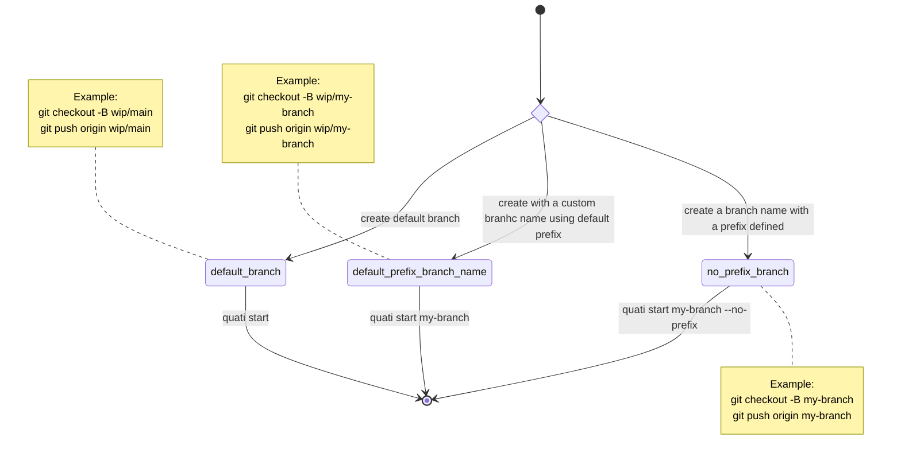

# 2:TASK: Create start command

AS a developer
I WANT to start a new branch
SO I want to run the command `quati start` and create a new branch locally and on origin

## Use Case

| id  | GIVEN                                                                                 | WHEN                                               | THEN                                                                                                                                                                                                                               |
| --- | ------------------------------------------------------------------------------------- | -------------------------------------------------- | ---------------------------------------------------------------------------------------------------------------------------------------------------------------------------------------------------------------------------------- |
| 1   | a git repository with an `origin` remote configured and the user has push permissions | the developer runs `quati start` without arguments | a new branch named using the configured prefix and the current branch name (e.g. `wip/<current_branch>`) is created locally and pushed to origin with upstream set, and the CLI prints the created branch and remote tracking info |
| 2   | a git repository with an `origin` remote configured and the user has push permissions | the developer runs `quati start BRANCH_NAME`       | a new branch `BRANCH_NAME` is created locally and pushed to origin with upstream set, and the CLI prints the created branch and remote tracking info                                                                               |
| 3   | the target branch already exists locally                                              | the developer runs `quati start [BRANCH]`          | the CLI switches to the existing branch, attempts to sync with origin, and prints a clear message indicating the branch already existed and what actions were taken                                                                |
| 4   | there is no `origin` remote or the push fails (network/auth)                          | the developer runs any `quati start` variant       | the CLI reports a clear error explaining the problem and suggests remediation (e.g. add remote, check network, retry push, or run manual `git push -u origin <branch>`)                                                            |

## State Diagram

